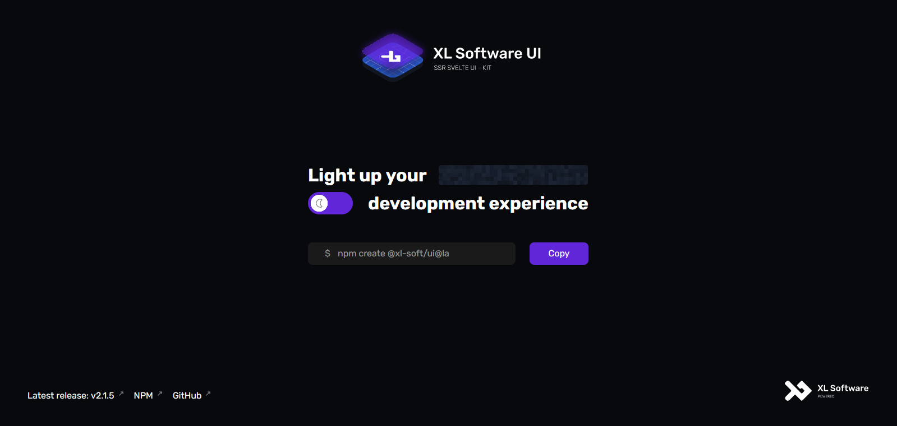

<br/>
<br/>
<div align="middle">
    
</div>

#

<h3 align="center">
    <strong>XL Software UI</strong> - fully JSDoc documented, SSR compatible, type safe Svelte 4 UI-kit 
</h3>
<br/>
<p align="right">
    
    
    
</p>

> **XL Software UI** - Next Generation Svelte 4 UI-kit for creating beautiful interfaces with excellent User Expirience

<h2 id="install"><strong>🔗 Useful Links</strong></h2>

* <a href="#install">Installation</a>
* <a href="#docs">Documentation</a>
* <a href="#community">Community</a>
* <a href="#sponsor">Donations</a>
* <a href="#bugs">Bug report</a>
* <a href="#license">License</a>

<h2 id="install"><strong>💾 Installation</strong></h2>

### **From scratch:**

``` bash
npm create @xl-soft/ui@latest
```

### **Import in existing project:**

``` bash
npm i @xl-soft/ui@latest
```

> Then add to your tsconfig.json

```json
{
    "compilerOptions": {
        "moduleResolution": "Bundler"
    },
}
```

### You are ready to go!



<h2 id="docs"><strong>📄 Documentation</strong></h2>

### **JSDoc**

All components, functions and types are documented with JSDoc for beatiful developer expirience


### **Full documentation**

⚠️ WORK IN PROGRESS ⚠️

<h2 id="community"><strong>👋 Community</strong></h2>

⚠️ WORK IN PROGRESS ⚠️

<h2 id="sponsor"><strong>💸 Donations</strong></h2>

⚠️ WORK IN PROGRESS ⚠️

<h2 id="bugs"><strong>🐞 Bug report</strong></h2>
<br/>
<div align="middle">
    <a href="https://github.com/xl-soft/ui/issues/new/choose" >
        
    </a>
</div>

<h2 id="license"><strong>📜 License</strong></h2>

[GNU GPLv3](https://github.com/xl-soft/blob/master/LICENSE.md)
